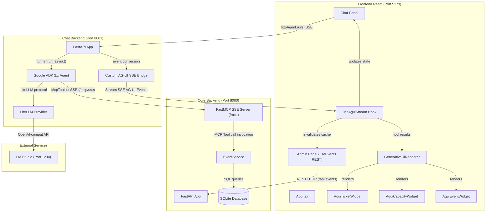
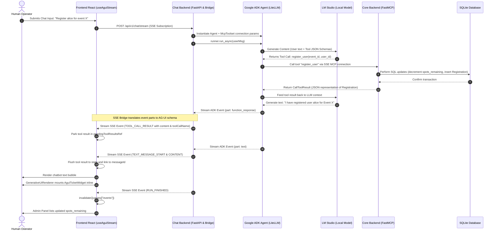

# Event Management Platform — Architecture, Agents, & Generative UI Reference

This repository houses a local-first, agent-assisted Event Management Platform. It allows a human operator to manage events directly through an admin UI, while simultaneously interacting with a locally-running LLM agent that executes tasks and renders rich, interactive React widgets inline.

---

## 1. System Architecture

The platform is divided into three decoupled services:

1. **`core-backend` (Port 8000)**: A transactional FastAPI application backed by SQLite (via SQLModel). It manages persistent data models, holds all core business rules, and exposes a FastMCP tool server via Server-Sent Events (SSE).
2. **`chat-backend` (Port 8001)**: An agent orchestration FastAPI service using Google ADK 2.x and LiteLLM to interface with a local LLM. It acts as an MCP client and translates raw ADK events into the frontend's expected SSE event stream.
3. **`frontend` (Port 5173)**: A React 19 client styled with Tailwind CSS v4 and shadcn/ui. It features an Admin Dashboard (with REST-driven CRUD operations) and an Agent Chat Tray capable of rendering dynamic widgets.
4. **`LM Studio` (Port 1234)**: An external local LLM runtime serving OpenAI-compatible chat completion endpoints.



---

## 2. Code Execution Flow

The sequence diagram below displays the execution path of a user prompt (e.g., `"Register Alice for Event X"`) from the UI, through the LLM and the MCP server, and back to a rendered widget on the screen:



---

## 3. Services Deep Dive

### Core Backend (`core-backend/`)
* **Technology Stack**: Python, FastAPI, SQLModel (ORM wrapping SQLAlchemy), FastMCP, SQLite.
* **Roles**: Persistence and core business rules. It contains REST endpoints for the standard Admin UI and handles FastMCP tool execution.
* **Database Design**:
  * All primary keys are UUIDs to prevent collisions.
  * `Event.spots_remaining` is a denormalized integer field. The database service decrements it during registration and increments it on unregistration within a single ACID-compliant SQL session transaction. The ground truth (should divergence occur) is `capacity - COUNT(registrations)`.
* **Business Rules in `EventService`**:
  * Event creation validates that dates are naive UTC datetimes in the future.
  * Registration checks:
    1. Prevents registrations for past events.
    2. Prevents registrations if `spots_remaining <= 0` (capacity limit).
    3. Enforces uniqueness (prevents a user from registering twice for the same event).
  * Capacity adjustments cannot drop below the active registration count.

### Chat Backend (`chat-backend/`)
* **Technology Stack**: Python, FastAPI, Google ADK 2.x, LiteLLM.
* **Orchestration & LLM Connection**:
  * LiteLLM routes chat requests to LM Studio's OpenAI-compatible backend at `http://127.0.0.1:1234`.
  * The model is set to `temperature=0.0` inside `GenerateContentConfig` to ensure deterministic tool selection.
  * Google ADK 2.x instantiates the agent loop with `McpToolset`, pointing directly to the Core Backend's SSE MCP endpoint (`http://127.0.0.1:8000/mcp/sse`).
* **Custom AG-UI SSE Bridge (`agui_bridge.py`)**:
  * Because third-party middleware packages can be opaque, `agui_bridge.py` inspects the streamed Google ADK events (`event.content.parts`) and translates them directly:
    * Non-thought text parts -> `TEXT_MESSAGE_START`, `TEXT_MESSAGE_CONTENT`, and `TEXT_MESSAGE_END`
    * Function calls -> `TOOL_CALL_START`, `TOOL_CALL_ARGS`, and `TOOL_CALL_END`
    * Function responses -> `TOOL_CALL_RESULT`
  * The resulting payloads are formatted as standard Server-Sent Events (`data: {...}\n\n`).

### Frontend (`frontend/`)
* **Technology Stack**: React 19, Vite, Tailwind CSS v4, `@ag-ui/client`, React Query.
* **Vite Proxy Dev Routing**:
  * The Vite dev server resolves relative URLs via proxies:
    * `/api/events` -> `http://127.0.0.1:8000` (Core Backend REST API)
    * `/api/v1` -> `http://127.0.0.1:8001` (Chat Backend SSE endpoint)
* **Custom SSE Subscription (`useAguiStream.ts`)**:
  * Uses `@ag-ui/client`'s class-based API: `new HttpAgent({ url }).run(input)` to receive an RxJS Observable of incoming events.
  * It validates all events through Zod schemas exposed by `@ag-ui/core`.
  * **Admin Panel Synchronization**: In order to prevent the Admin Panel's cache from growing stale when the agent performs mutations (bypassing REST), the hook calls `queryClient.invalidateQueries({ queryKey: ['events'] })` upon receiving a `RUN_FINISHED` event. This forces the Admin Panel's React Query hooks (`useEvents.ts`) to refetch the events exactly once per agent turn.

---

## 4. The Generative UI Pipeline

The pipeline enables React components to mount inline within chatbot messages based on specific tool executions:

```
[Tool Executes] ──> [TOOL_CALL_RESULT Event] ──> [useAguiStream Hook] ──> [GenerativeUiRenderer] ──> [Target Widget]
```

### Step 1: Tool Association
The frontend maps MCP tool names to visual components via registries in [GenerativeUiRenderer.tsx](file:///g:/origin_exercize/frontend/src/components/agui/GenerativeUiRenderer.tsx):
* `register_user` $\rightarrow$ `AguiTicketWidget`
* `update_event_capacity` $\rightarrow$ `AguiCapacityWidget`
* `create_event` $\rightarrow$ `AguiEventWidget`

### Step 2: The Parsing Layer
FastMCP wraps tool returns inside a standard `CallToolResult` schema. When received, `GenerativeUiRenderer` unwraps the nested data structure:
```typescript
function extractToolData(raw: unknown): unknown {
  if (raw && typeof raw === 'object' && !Array.isArray(raw)) {
    const obj = raw as Record<string, unknown>
    const sc = obj.structuredContent as Record<string, unknown> | undefined
    if (sc?.result !== undefined) return sc.result
    const items = obj.content as Array<Record<string, unknown>> | undefined
    if (Array.isArray(items) && items.length > 0) {
      const first = items[0]
      if (first?.type === 'text' && typeof first?.text === 'string') {
        try { return JSON.parse(first.text) } catch {}
      }
    }
  }
  return raw;
}
```
This isolates the raw domain object (like `EventDict` or `RegistrationDict`) and passes it directly to the corresponding React widget.

### Step 3: Interactive Affordances (Prefill Pattern)
Widgets support direct callbacks to invoke agent actions. For example, `AguiTicketWidget` provides an "Unregister" button.
Rather than invoking the backend REST API directly, it uses the **Natural Language Prefill** pattern:
1. Clicking the button calls `onUnregister("Unregister user <user_id> from event <event_name>")`.
2. The callback inserts the text directly into the chat input and focuses it.
3. The user presses enter, allowing the LLM agent to handle the cancellation (enforcing business rules and maintaining conversation history).

---

## 5. Setup & Running the Platform

### Dependencies & Setup
Verify you have `uv` (for Python) and `pnpm` (for Node.js) installed. 

In separate terminal windows, run the following commands in order:

```bash
# 1. Start the Core Backend (launches database & FastMCP Server)
cd core-backend
uv run uvicorn app.main:app --host 127.0.0.1 --port 8000 --reload

# 2. Start the Chat Backend (connects to Core Backend's MCP endpoint)
cd chat-backend
uv run uvicorn app.main:app --host 127.0.0.1 --port 8001 --reload

# 3. Start the Frontend
cd frontend
pnpm dev
```

Ensure LM Studio is running on `http://127.0.0.1:1234` with an active, function-calling-capable model loaded (e.g. `qwen2.5-7b-instruct` or similar).

Access the platform at `http://localhost:5173`.

---

## 6. Running Tests

```bash
# Core Backend tests (tests services & in-process MCP server queries)
cd core-backend && uv run pytest tests/ -v

# Chat Backend tests (tests agent configuration & bridge translations)
cd chat-backend && uv run pytest tests/ -v

# Frontend tests (tests state machines, streams, and UI widgets)
cd frontend && npx vitest run
```

---

## 7. Known Architectural Gotchas & Decisions

* **`TOOL_CALL_RESULT` Zod Constraints**: The `@ag-ui/core` `EventSchemas` Zod validator requires `TOOL_CALL_RESULT` to contain a `messageId`, `toolCallId`, `content`, and `role`. If any of these are missing, or if `result` is sent instead of `content`, the Zod validator throws a validation exception and instantly crashes the RxJS stream, causing subsequent events to fail silently.
* **LiteLLM prefix for LM Studio**: The model configured in `chat-backend/app/config.py` must use the `lm_studio/` prefix (e.g., `lm_studio/qwen-35b-instruct`). Using a generic `openai/` prefix routes through LiteLLM's generic provider, which triggers a default Jinja template renderer inside LM Studio for tool parameters. This renderer fails on certain tool schemas, resulting in a HTTP 400 error. The `lm_studio/` provider handles schema conversions differently and bypasses this template bug.
* **Thinking Model Traces**: Reasoning models output internal thoughts as parts with `thought=True` via Google ADK. The custom bridge filters these out by verifying `not getattr(part, "thought", False)` and stripping leading/trailing whitespace to prevent empty chat bubble rendering.
* **Timezone Normalization**: SQLite does not store timezone offsets natively. Dates sent by the UI/Agent arrive as timezone-aware ISO 8601 strings. To prevent timezone mismatch errors, `EventService` strips timezone designators (calling `.replace(tzinfo=None)`) before performing comparisons, assuming naive UTC representations throughout the database.
* **Tool Result Parking**: Tool responses from the ADK Runner emit before the text response begins. Since the message ID for the assistant bubble is generated at `TEXT_MESSAGE_START`, the frontend parks tool results in a `pendingToolResultsRef` and flushes them with the correct ID only when the text stream starts.